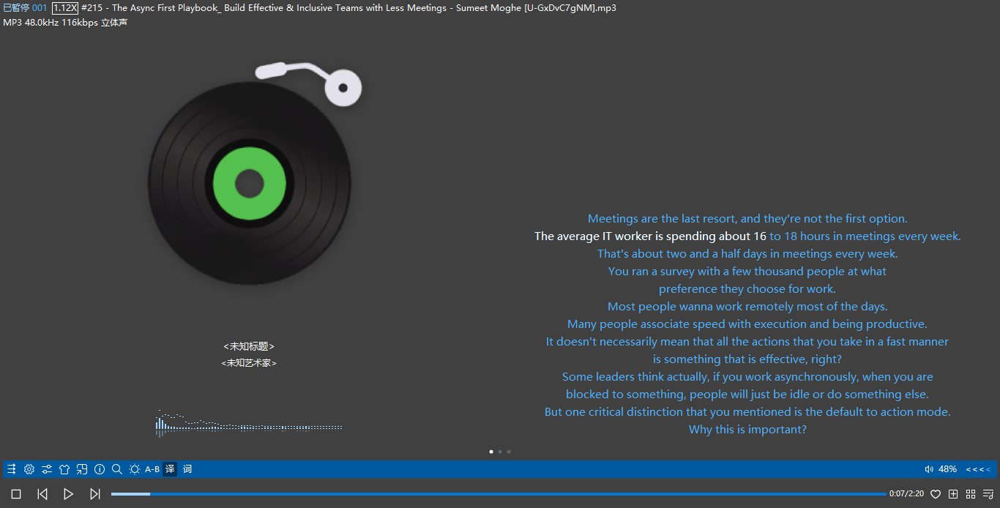

# YouTube to MP3 with Lyrics

A powerful Python tool that downloads YouTube videos, extracts audio segments, and embeds synchronized lyrics into MP3 files. This tool automatically downloads subtitles, converts them to LRC format, and embeds them directly into the MP3 metadata. It also features an optional spatial stereo enhancement for a richer audio experience.



## Features

- 🎵 **Audio Extraction**: Download and extract high-quality MP3 audio from YouTube videos.
- 🔄 **File Merge Mode**: Combine existing audio files (MP3, MP4, WAV, etc.) with SRT subtitle files.
- 🎧 **Spatial Stereo Enhancement**: Apply spatial stereo enhancement to mono or pseudo-stereo audio for a wider, more immersive sound (optional).
- 📝 **Subtitle Processing**: Automatically download and convert **SRT** subtitles to LRC format.
- ✨ **Smart Subtitle Selection**: Intelligently detects all available manual and auto-generated subtitles, and uses the best available option.
- ⏱️ **Time-based Segmentation**: Extract specific time segments from videos or apply time filtering to merged files.
- 🎤 **Lyrics Embedding**: Embed synchronized lyrics directly into MP3 metadata.
- 🗂️ **Smart Caching**: Avoid re-downloading existing files with intelligent caching.
- 🧹 **Clean Workflow**: Automatic cleanup of intermediate files (optional).
- 🌍 **Multi-language Support**: Lists all available subtitle languages for easy selection.

## Prerequisites

- Python 3.6 or higher
- `yt-dlp` (YouTube downloader)
- `ffmpeg` (for audio processing)

## Installation

1.  **Clone the repository:**
    ```bash
    git clone https://github.com/your-username/YoutubeToMP3WithLyrics.git
    cd YoutubeToMP3WithLyrics
    ```

2.  **Create and activate a virtual environment:**
    ```bash
    python3 -m venv venv
    source venv/bin/activate  # On Windows: venv\Scripts\activate
    ```

3.  **Install dependencies:**
    ```bash
    pip install -r requirements.txt
    ```

4.  **Install system dependencies:**
    - **Ubuntu/Debian:**
      ```bash
      sudo apt update
      sudo apt install ffmpeg
      ```
    - **macOS:**
      ```bash
      brew install ffmpeg
      ```
    - **Windows:**
      Download ffmpeg from [official website](https://ffmpeg.org/download.html) and add to PATH.

## Usage

### YouTube Download Mode

```bash
python youtube_to_mp3_with_lyrics.py "YOUTUBE_URL" [OPTIONS]
```

### File Merge Mode

```bash
python youtube_to_mp3_with_lyrics.py --merge --audio AUDIO_FILE --subtitle SUBTITLE_FILE -o OUTPUT_DIR [OPTIONS]
```

### Parameters

#### YouTube Download Mode
- `url`: YouTube video URL (required).
- `-s, --start`: Start time in MM:SS or HH:MM:SS format (optional). If not provided, the video starts from the beginning.
- `-e, --end`: End time in MM:SS or HH:MM:SS format (optional). If not provided, the video goes to the end.
- `-l, --lang`: Subtitle language code (default: 'en').
- `--source-dir`: Directory for source files (default: './source_files').
- `-o, --output`: Output directory for final MP3 files (default: './final_mp3s').
- `--no-cleanup`: Keep all intermediate files.
- `--enhance-stereo`: Apply spatial stereo enhancement to the audio.

#### File Merge Mode
- `--merge`: Enable merge mode (required for merging existing files).
- `--audio`: Path to audio file (supports MP3, MP4, WAV, etc.) (required in merge mode).
- `--subtitle`: Path to SRT subtitle file (required in merge mode).
- `-o, --output`: Output directory for the final MP3 file (default: './final_mp3s').
- `-s, --start`: Start time for subtitle filtering (optional).
- `-e, --end`: End time for subtitle filtering (optional).
- `--enhance-stereo`: Apply spatial stereo enhancement to the audio.

### Examples

#### YouTube Download Mode

1.  **Download a full video with English subtitles:**
    ```bash
    python youtube_to_mp3_with_lyrics.py "https://www.youtube.com/watch?v=VIDEO_ID"
    ```

2.  **Extract a 2-minute segment with English subtitles:**
    ```bash
    python youtube_to_mp3_with_lyrics.py "https://www.youtube.com/watch?v=VIDEO_ID" -s 1:30 -e 3:30
    ```

3.  **Extract with Spanish subtitles and enhance audio:**
    ```bash
    python youtube_to_mp3_with_lyrics.py "https://www.youtube.com/watch?v=VIDEO_ID" -s 0:00 -e 5:00 -l es --enhance-stereo
    ```

4.  **Custom directories and keep intermediate files:**
    ```bash
    python youtube_to_mp3_with_lyrics.py "https://www.youtube.com/watch?v=VIDEO_ID" -s 2:15 -e 4:45 --source-dir ./downloads -o ./music --no-cleanup
    ```

#### File Merge Mode

1.  **Merge an MP4 video with an SRT subtitle into a new directory:**
    ```bash
    python youtube_to_mp3_with_lyrics.py --merge --audio video.mp4 --subtitle subtitles.srt -o ./merged_files
    ```
    *This will create `merged_files/video.mp3`.*

2.  **Merge an existing MP3 with subtitles and apply time filtering:**
    ```bash
    python youtube_to_mp3_with_lyrics.py --merge --audio audio.mp3 --subtitle subtitles.srt -o ./filtered_music -s 1:00 -e 3:00
    ```

3.  **Merge a WAV file with subtitles and enhance stereo:**
    ```bash
    python youtube_to_mp3_with_lyrics.py --merge --audio audio.wav --subtitle subtitles.srt -o ./enhanced_music --enhance-stereo
    ```

4.  **Merge using files from the default source directory:**
    ```bash
    # Assuming U-GxDvC7gNM.mp3 and U-GxDvC7gNM.en.srt exist in ./source_files
    python youtube_to_mp3_with_lyrics.py --merge --audio "source_files/U-GxDvC7gNM.mp3" --subtitle "source_files/U-GxDvC7gNM.en.srt" -o "final_mp3s"
    ```
    *This will create `final_mp3s/U-GxDvC7gNM.mp3` with embedded lyrics.*

## Spatial Stereo Enhancement

The `--enhance-stereo` option applies advanced audio processing to create a wider, more immersive stereo experience. This feature works in both YouTube download mode and file merge mode:

- **For YouTube downloads**: Applied after audio extraction
- **For file merging**: Applied during the conversion process, regardless of input format (MP3, MP4, WAV, etc.)
- **Audio processing**: Uses a sophisticated filter chain including extrastereo, haas effect, and volume normalization
- **Output quality**: Maintains high-quality 192kbps MP3 with 44.1kHz sample rate

This enhancement is particularly effective for:
- Mono audio sources
- Pseudo-stereo content
- Audio that lacks spatial depth
- Music and speech content that benefits from wider stereo imaging

## How It Works

### YouTube Download Mode
1.  **Metadata Extraction**: Retrieves video title and ID from YouTube.
2.  **Subtitle Discovery**: Scans the video for all available manual and auto-generated subtitles and displays them in a clear, organized list.
3.  **Content Download**: Downloads the audio and the selected **SRT** subtitle file using `yt-dlp`. The script intelligently chooses between manually created or auto-generated subtitles based on availability.
4.  **Audio Enhancement (Optional)**: If requested, applies a spatial stereo filter chain using `ffmpeg` to enhance the audio's stereo width.
5.  **Subtitle Processing**: Converts the downloaded **SRT** subtitles to LRC format with proper timing adjusted for the specified start time.
6.  **Lyrics Embedding**: Embeds the synchronized LRC lyrics into the MP3's metadata using `eyed3`.
7.  **File Organization**: Saves the final MP3 with embedded lyrics to the output directory.
8.  **Cleanup**: Optionally removes intermediate files (source MP3, SRT, LRC).

### File Merge Mode
1.  **File Validation**: Checks that both audio and subtitle files exist.
2.  **Audio Conversion**: Converts input audio (MP4, WAV, etc.) to MP3 format if needed.
3.  **Audio Enhancement (Optional)**: Applies spatial stereo enhancement to any audio format, including existing MP3 files.
4.  **Subtitle Processing**: Converts SRT subtitles to LRC format with optional time filtering.
5.  **Lyrics Embedding**: Embeds the synchronized LRC lyrics into the final MP3 file.
6.  **Cleanup**: Automatically removes temporary processing files.

## Dependencies

- **yt-dlp**: YouTube video/audio downloader.
- **eyeD3**: MP3 metadata manipulation.
- **Standard libraries**: os, subprocess, sys, argparse, re, shutil, time, typing.

## Subtitle Language Detection

The tool **automatically detects and lists all available subtitle languages** for the given video, separated into "Manual Subtitles" and "Automatic Subtitles".

- **Manual Subtitles**: Higher quality, created by the video owner.
- **Automatic Subtitles**: Auto-generated by YouTube, quality may vary.

The script will always prioritize manual subtitles for the requested language. If a manual version is not found, it will automatically fall back to an available auto-generated version. If the language is not found at all, it will display the list of all available languages for you to choose from and exit.

## Error Handling

The tool includes comprehensive error handling for:
- Invalid YouTube URLs
- Missing subtitles, with a clear list of available options
- Network connectivity issues during subtitle listing
- File permission problems
- Invalid time formats
- Audio processing errors with `ffmpeg`

## Troubleshooting

1.  **"Command not found" errors**: Ensure `yt-dlp` and `ffmpeg` are properly installed and accessible in your system's PATH.
2.  **Permission errors**: Check write permissions for the source and output directories.
3.  **Subtitle not available**: The script will list all available language codes. If your desired language isn't listed, it means YouTube does not provide it for that video.
4.  **Invalid time format**: Use MM:SS or HH:MM:SS format (e.g., `1:30` or `0:01:30`).

## Contributing

1.  Fork the repository.
2.  Create a feature branch.
3.  Make your changes.
4.  Add tests if applicable.
5.  Submit a pull request.

## License

This project is for educational and personal use. Please respect YouTube's Terms of Service and copyright laws when using this tool.

## Disclaimer

This tool is intended for personal use and educational purposes. Users are responsible for ensuring they have the right to download and use the content they process with this tool.
